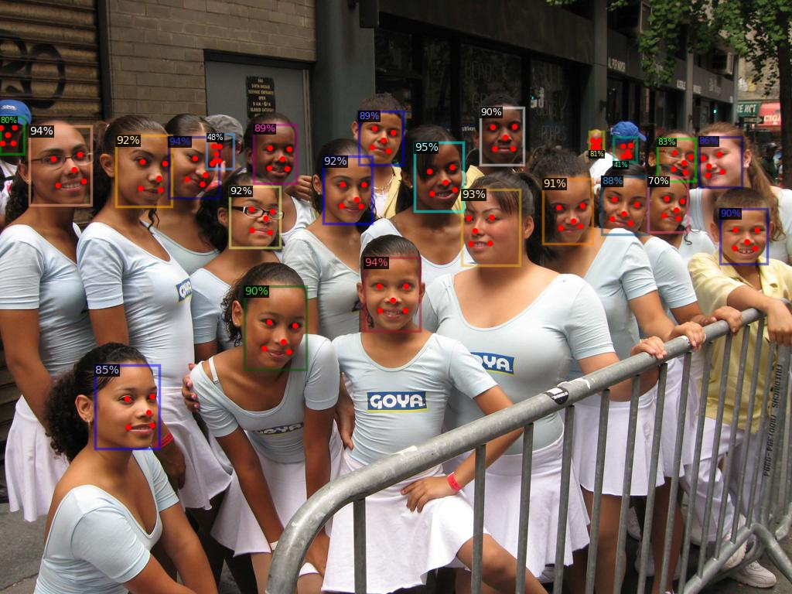

<!--
 * @Copyright (c) tkianai All Rights Reserved.
 * @Author         : tkianai
 * @Github         : https://github.com/tkianai
 * @Date           : 2020-04-25 12:34:30
 * @FilePath       : /RetinaFace.detectron2/README.md
 * @Description    : 
 -->


# RetinaFace.detectron2

RetinaFace detector based on detectron2.




## TODO

- [x] Baseline R-50
- [x] Baseline mnet[v1, v2]
- [x] Update the Conv and Norm Used
- [x] Update to suitable for latest detectron2 version: remove duplicate anchors
- [ ] Add DFConv
- [ ] Add BiFPN
- [ ] Add other backbones
- [ ] Add visual samples


## Usage

### Train a new model with this project

- Stylize the original `widerface` dataset to coco-style

```sh
python tools/widerface_stylized_coco.py 
```

- Train

```sh
python train_net.py --num-gpus <number of gpus> --config-file <your config file>
```

For example, train with a baseline with backbone(`resnet50`), you can use this codes:

```sh
python train_net.py --num-gpus 4 --config-file configs/retinaface/retinaface_R_50_FPN.yaml
```


### Test a trained model with this project


When testing model, you only need to specify the following essential arguments:

- `config-file`: the same with the config file when you training the model
- `input`: video path or `regular match` file path
- `output`: specify the output folder to save the result
- `opts`: loading the latest trained checkpoint

For example, 

```sh
python demo.py --config-file configs/retinaface/retinaface_R50_FPN.yaml --input datasets/widerface/val/images/*/*.jpg --output work_dirs/retinaface_R_50_FPN/val  --opts MODEL.WEIGHTS work_dirs/retinaface_R_50_FPN/model_final.pth
```


### Evaluate a trained model using the widerface toolsets


After generated the result(`Test part`),

- Change the results format into `widerface` style

```sh
python tools/predictions_to_widerface_val.py --res work_dirs/retinaface_R_50_FPN/val/results.pkl --save work_dirs/retinaface_R_50_FPN/widerface
```

- Use `widerface_evaluate` to visual the performance

```sh
cd tools/widerface_evaluate
python evaluation.py --p ../../work_dirs/retinaface_R_50_FPN/widerface
```